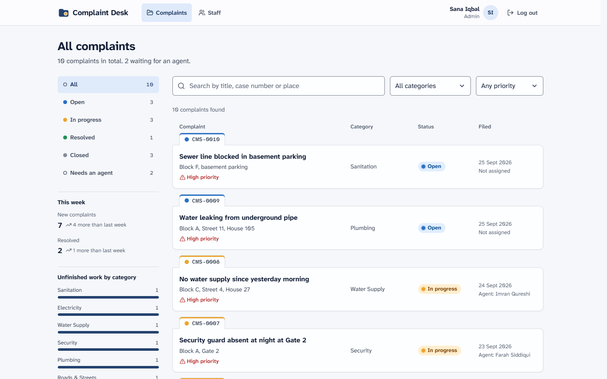
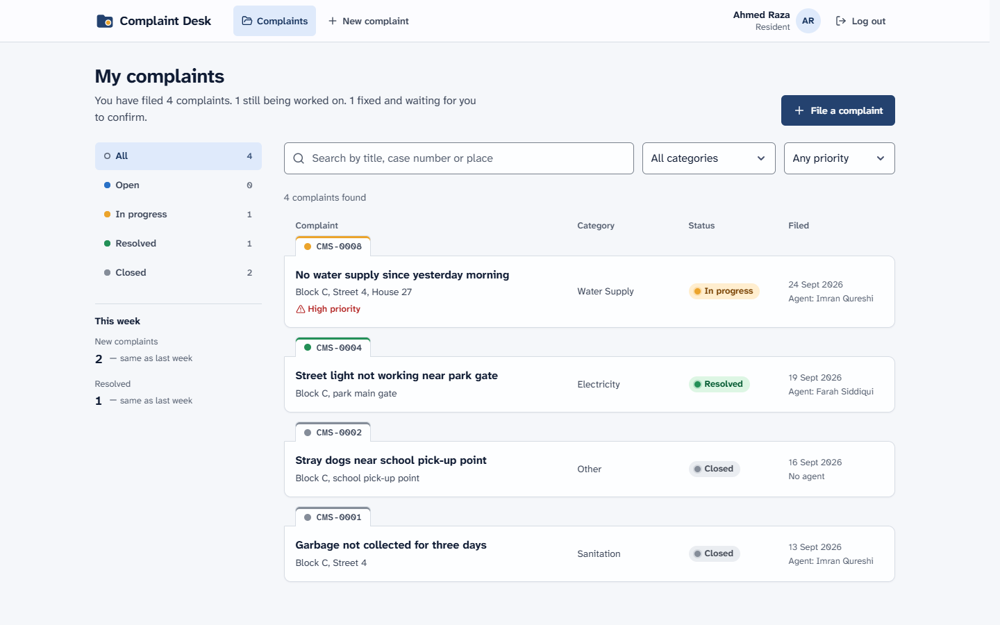
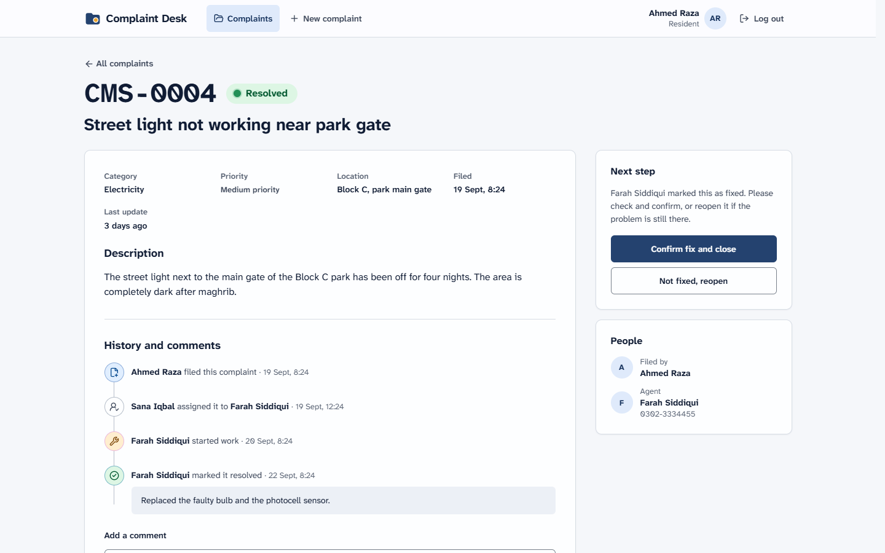
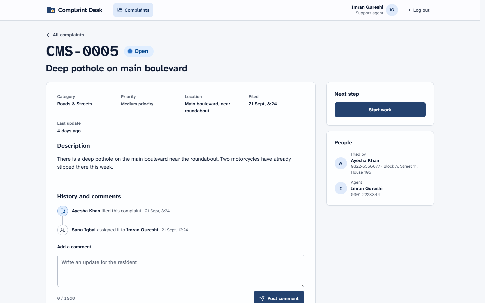
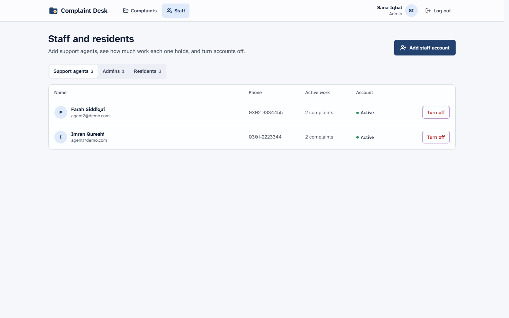
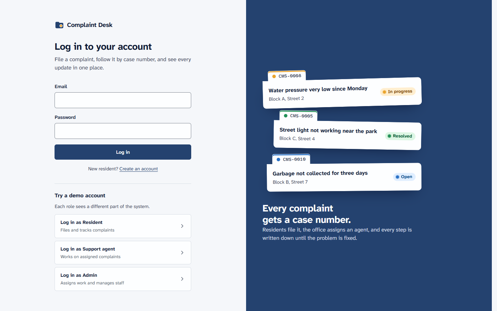
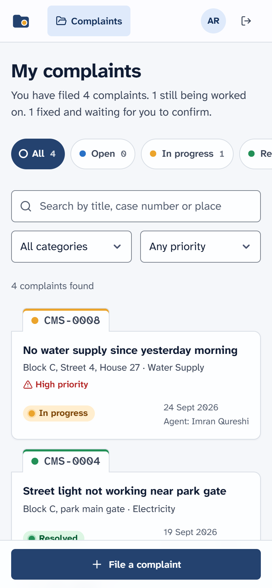
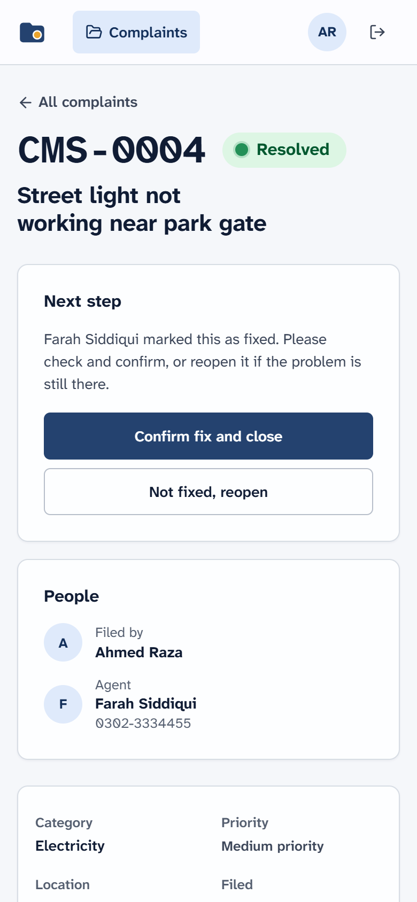

# Complaint Desk

A full stack MERN web app for a housing society. Residents file complaints, support agents fix them, and admins assign the work and keep an eye on the numbers.

I worked 3 years as a Customer Care Representative at a housing society complaint center, handling resident complaints every day. The question I heard most was "what happened to my complaint?". This project answers it: every complaint gets a case number, every step is written down, and residents can see the progress themselves.



## What it does

**Residents**
- Create an account and log in
- File a complaint with a category, priority, location and description
- Get a case number right away (CMS-0001, CMS-0002, ...)
- Follow the status, read notes from the agent, and reply with comments
- Confirm the fix and close the complaint, or reopen it if the problem is still there

**Support agents**
- See only the complaints assigned to them
- Start work, then mark it resolved with a note about what was done
- Talk to the resident through comments

**Admins**
- See every complaint, with a "Needs an agent" queue
- Assign or reassign agents, and see how many open complaints each agent holds
- Weekly trends (new and resolved, compared with last week) and unfinished work by category
- Add staff accounts and turn accounts off

**Everyone**
- Search by title, case number or place, filter by status, category and priority
- Filters live in the URL, so a filtered list can be bookmarked or shared
- A "My account" page to change your name, email, phone and address, and to change your password
- Works on phones and on desktop

## Screenshots

| Resident: my complaints | Resident: complaint detail |
|---|---|
|  |  |

| Agent: working on a complaint | Admin: staff management |
|---|---|
|  |  |

| Login with demo accounts | On a phone |
|---|---|
|  |   |

## Status flow

```
            start work              mark resolved           confirm fix
  Open  ─────────────────►  In progress  ─────────────►  Resolved  ─────────────►  Closed
   │     (agent or admin,        ▲        (agent or admin,    │     (resident or admin)
   │      agent must be          │         note required)     │
   │      assigned first)        └────────────────────────────┘
   │                                   not fixed, reopen
   │                             (resident or admin, note required)
   └──────────────────────────────────────────────────────────────────────────►  Closed
                          close without action (admin only, note required)
```

The same rules live in one table (`TRANSITIONS` in `server/src/constants.js`). The server checks them on every request, and the React app uses a copy only to decide which buttons to show.

## Tech stack

| Layer | Tech |
|---|---|
| Frontend | React 19, React Router, Vite, plain CSS with design tokens, lucide icons |
| Backend | Node.js, Express 5 |
| Database | MongoDB with Mongoose |
| Auth | JSON Web Tokens, passwords hashed with bcrypt |
| Tests | Node test runner, Supertest, in-memory MongoDB |

## How it works

- **Login:** the server checks the password with bcrypt and returns a signed JWT. The React app stores it and sends it as a `Bearer` token. If the token expires, the app logs out by itself.
- **Password change:** each user has a `tokenVersion` that is also written into their token. Changing the password increases it, so tokens on every other device stop working at once, while the device that made the change gets a fresh token.
- **Roles:** every API route checks who is asking. Residents only ever get their own complaints and agents only the ones assigned to them. Asking for someone else's complaint returns 404, so nobody can guess which case numbers exist.
- **Case numbers:** a small `counters` collection is increased with `$inc` for each new complaint, so two complaints filed at the same moment never get the same number.
- **History:** every status change and assignment is saved with who did it and when. The detail page merges this history with the comments into one timeline.
- **Safety:** passwords are never sent back by the API, input is checked in the browser and again on the server, and unknown errors return a generic message.

A longer, plain English walkthrough for interviews is in [docs/HOW-IT-WORKS.md](docs/HOW-IT-WORKS.md). The design system (colors, type, spacing and the rules behind the "case file" look) is written down in [docs/DESIGN.md](docs/DESIGN.md).

## Try it locally

### Requirements

- Node.js 20 or newer
- Nothing else. `npm run dev` starts a local MongoDB for you. The first run downloads the MongoDB program once, so it can take a minute.

### Setup

```bash
# 1. Get the code
git clone https://github.com/rahilkhan5/complaint-management-system.git
cd complaint-management-system

# 2. Install everything (root, server and client)
npm run install:all

# 3. Create the server settings file, then open it and set JWT_SECRET to a long random string
cp server/.env.example server/.env

# 4. Start the database, the API and the React app together
npm run dev

# 5. In a second terminal, load the demo data
npm run seed
```

Open http://localhost:5173 and use one of the demo buttons on the login page.

### Demo accounts

All demo accounts use the password `Demo@1234`.

| Role | Email | Name |
|---|---|---|
| Resident | resident@demo.com | Ahmed Raza |
| Support agent | agent@demo.com | Imran Qureshi |
| Support agent | agent2@demo.com | Farah Siddiqui |
| Admin | admin@demo.com | Sana Iqbal |

### Using MongoDB Atlas instead

Put your Atlas connection string in `MONGO_URI` inside `server/.env`, then start only the API and the app with `npm run dev:app`.

### Environment variables (`server/.env`)

| Name | What it is | Example |
|---|---|---|
| `PORT` | Port for the API | `5000` |
| `CLIENT_URL` | Address of the React app, allowed by CORS | `http://localhost:5173` |
| `MONGO_URI` | MongoDB connection string | `mongodb://127.0.0.1:27017/complaint-management` |
| `JWT_SECRET` | Secret used to sign login tokens | a long random string |
| `JWT_EXPIRES_IN` | How long a login lasts | `7d` |

## Scripts

Run these from the project folder.

| Command | What it does |
|---|---|
| `npm run install:all` | Install dependencies in root, server and client |
| `npm run dev` | Start local MongoDB, the API and the React app together |
| `npm run dev:app` | Start only the API and the React app (for Atlas) |
| `npm run seed` | Reset the database with demo users and complaints |
| `npm test` | Run the API tests |
| `npm run lint` | Check the React code |
| `npm run build` | Build the React app for production |

## API

All routes start with `/api`. Routes marked with a lock need a `Bearer` token.

| Method | Route | Who | What it does |
|---|---|---|---|
| GET | `/health` | anyone | API and database status |
| POST | `/auth/register` | anyone | Create a resident account |
| POST | `/auth/login` | anyone | Log in and get a token |
| GET | `/auth/me` | 🔒 any user | The logged in user |
| PATCH | `/auth/me` | 🔒 any user | Update your own name, email, phone and address |
| PATCH | `/auth/password` | 🔒 any user | Change your password (needs the current one) and log out other devices |
| GET | `/complaints` | 🔒 any user | List complaints the user may see. Filters: `status`, `category`, `priority`, `q`, `unassigned`, `page`, `limit` |
| GET | `/complaints/stats` | 🔒 any user | Counts by status, weekly trends, and for admins the category breakdown |
| POST | `/complaints` | 🔒 resident | File a complaint |
| GET | `/complaints/:id` | 🔒 owner, assignee, admin | One complaint with history and comments |
| PATCH | `/complaints/:id/status` | 🔒 depends on the status flow | Change the status, with a note when needed |
| PATCH | `/complaints/:id/assign` | 🔒 admin | Assign or reassign an agent |
| POST | `/complaints/:id/comments` | 🔒 owner, assignee, admin | Add a comment |
| GET | `/users` | 🔒 admin | List users with each agent's open workload |
| POST | `/users` | 🔒 admin | Create an agent or admin account |
| PATCH | `/users/:id` | 🔒 admin | Turn an account on or off |

## Tests

```bash
npm test
```

26 API tests cover sign up and login, who can see which complaint, the full status flow, reopening, blocked status jumps, comments, stats, search, the "needs an agent" queue, staff management, and updating your own account and password. Each test run uses its own in-memory MongoDB, so it never touches your data.

## Folder structure

```
complaint-management-system/
├── client/                    React app (Vite)
│   └── src/
│       ├── api/               fetch wrapper and one function per API call
│       ├── components/        reusable pieces: sticker, file list, timeline, fields
│       ├── context/           logged in user (AuthProvider, useAuth)
│       ├── hooks/             small shared hooks
│       ├── pages/             one file per screen
│       ├── styles/            tokens, base, components, layout, pages
│       ├── constants.js       labels and the status rules for the UI
│       └── App.jsx            routes
├── server/                    Express API
│   ├── scripts/               local database and demo data
│   ├── src/
│   │   ├── config/            database connection
│   │   ├── controllers/       what each route does
│   │   ├── middleware/        login check, role check, errors
│   │   ├── models/            User, Complaint, Counter
│   │   ├── routes/            URL to controller mapping
│   │   ├── constants.js       roles, categories and status rules
│   │   └── app.js             Express setup
│   └── test/                  API tests
└── docs/                      product notes, design system, walkthrough and screenshots
```

## What I would add next

- Photo upload on complaints
- Email or SMS when the status changes
- Live deployment (React on Vercel, API on Render, database on MongoDB Atlas)

## Author

**Rahil Khan**, Junior MERN Stack Developer, Karachi

- LinkedIn: [rahil-khan-92b640439](https://www.linkedin.com/in/rahil-khan-92b640439/)
- GitHub: [rahilkhan5](https://github.com/rahilkhan5)
